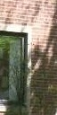
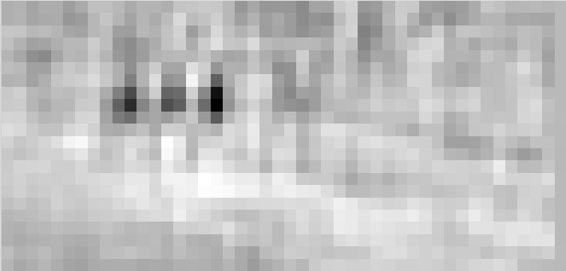

# Object Detection using HOG

In this tutorial, we will use Histogram of Oriented Gradient (HOG) feature descriptor based linear SVM to create a person detector. We will first create
a person classifier and then use this classifier with a sliding window to identify and localize people in an image.

The key challenge in creating a classifier is that it needs to work with variations in illumination, pose and occlusions in the image. To achieve this, we will train
the classifier on an intermediate representation of the image instead of the pixel-based representation. Our ideal representation (commonly called feature vector)
captures information which is useful for classification but is invariant to small changes in illumination and occlusions. HOG descriptor is a gradient-based
representation which is invariant to local geometric and photometric changes (i.e. shape and illumination changes) and so is a good choice for our problem. In fact HOG descriptors are widely used for object detection.

Download the script to get the training data [here](https://drive.google.com/file/d/11G_9zh9N-0veQ2EL5WDGsnxRpihsqLX5/view?usp=sharing). Download tutorial.zip, decompress it and run get_data.bash. (Change the variable `path_to_tutorial` in preprocess.jl and path to julia executable in get_data.bash). This script will download the required datasets. We will start by loading the data and computing HOG features of all the images.

```julia
using Images, ImageFeatures

path_to_tutorial = ""    # specify this path
pos_examples = "$path_to_tutorial/tutorial/humans/"
neg_examples = "$path_to_tutorial/tutorial/not_humans/"

n_pos = length(readdir(pos_examples))   # number of positive training examples
n_neg = length(readdir(neg_examples))   # number of negative training examples
n = n_pos + n_neg                       # number of training examples 
data = Array{Float64}(undef, 3780, n)   # Array to store HOG descriptor of each image. Each image in our training data has size 128x64 and so has a 3780 length 
labels = Vector{Int}(undef, n)          # Vector to store label (1=human, 0=not human) of each image.

for (i, file) in enumerate([readdir(pos_examples); readdir(neg_examples)])
    filename = "$(i <= n_pos ? pos_examples : neg_examples )/$file"
    img = load(filename)
    data[:, i] = create_descriptor(img, HOG())
    labels[i] = (i <= n_pos ? 1 : 0)
end
```

Basically we now have an encoded version of images in our training data. This encoding captures useful information but discards extraneous information 
(illumination changes, pose variations etc). We will train a linear SVM on this data.

```julia
using LIBSVM

#Split the dataset into train and test set. Train set = 2500 images, Test set = 294 images.
random_perm = randperm(n)
train_ind = random_perm[1:2500]
test_ind = random_perm[2501:end]

model = svmtrain(data[:, train_ind], labels[train_ind]);
```

Now let's test this classifier on some images.

```julia
img = load("$pos_examples/per00003.ppm")
descriptor = Array{Float64}(3780, 1)
descriptor[:, 1] = create_descriptor(img, HOG())

predicted_label, _ = svmpredict(model, descriptor);
print(predicted_label)                          # 1=human, 0=not human

# Get test accuracy of our model
predicted_labels, decision_values = svmpredict(model, data[:, test_ind]);
@printf "Accuracy: %.2f%%\n" mean((predicted_labels .== labels[test_ind]))*100 # test accuracy should be > 98%
```

Try testing our trained model on more images. You can see that it performs quite well.

|  |  |
|:------:|:---:|
| predicted_label = 1 | predicted_label = 1 |

|  |  |
|:------:|:---:|
| predicted_label = 1 | predicted_label = 0 |

Next we will use our trained classifier with a sliding window to localize persons in an image.


```julia
img = load("path_to_tutorial/tutorial/humans.jpg")
rows, cols = size(img)

scores = Array{Float64}(22, 45)
descriptor = Array{Float64}(3780, 1)

#Apply classifier using a sliding window approach and store classification score for not-human at every location in score array
for j in 32:10:cols-32
    for i in 64:10:rows-64
        box = img[i-63:i+64, j-31:j+32]
        descriptor[:, 1] = create_descriptor(box, HOG())
        predicted_label, s = svmpredict(model, descriptor);
        scores[Int((i-64)/10)+1, Int((j-32)/10)+1] = s[1]
    end
end
```



You can see that classifier gave low score to not-human class (i.e. high score to human class) at positions corresponding to humans in the original image. 
Below we threshold the image and suppress non-minimal values to get the human locations. We then plot the bounding boxes using `ImageDraw`.

```julia
using ImageDraw, ImageView

scores[scores.>0] = 0
object_locations = findlocalminima(scores)

rectangles = [[((i[2]-1)*10+1, (i[1]-1)*10+1), ((i[2]-1)*10+64, (i[1]-1)*10+1), ((i[2]-1)*10+64, (i[1]-1)*10+128), ((i[2]-1)*10+1, (i[1]-1)*10+128)] for i in object_locations];

for rec in rectangles
    draw!(img, Polygon(rec), RGB{N0f8}(0, 0, 1.0))
end
imshow(img)
```


In our example we were lucky that the persons in our image had roughly the same size (128x64) as examples in our train set. We will generally need to take bounding boxes across multiple scales (and multiple aspect ratios for some object classes).


